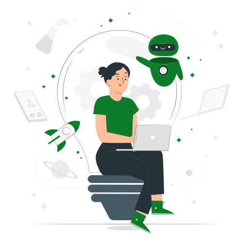
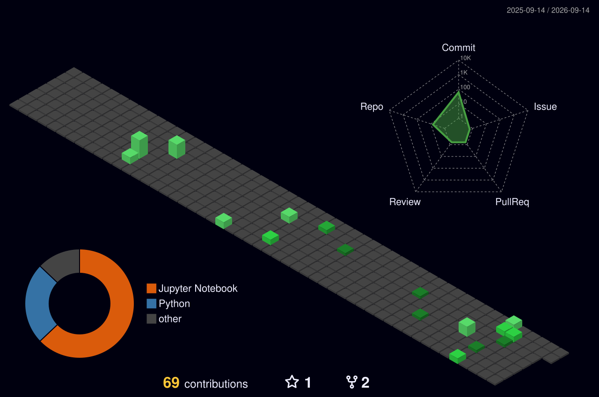

<!-- =================================================================================== -->
<!--                              AI OPERATING SYSTEM                                    -->
<!-- =================================================================================== -->


<div align="center">


<br>


</div>

---

# ⌭ AI Operating System Boot


```text
╔══════════════════════════════════════════════════════╗
║            AI OPERATING SYSTEM v3.1                  ║
╚══════════════════════════════════════════════════════╝

Loading Neural Engine............ ███████████ 100%

Loading Deep Learning Models..... ███████████ 100%

Loading Computer Vision.......... ███████████ 100%

Loading Retrieval Engine......... ███████████ 100%

Loading Vector Database.......... ███████████ 100%

Authentication Successful ✔

```

---

# ⌘ AI Profile

<table>
<tr>

<td width="60%" valign="top">

```yaml
Name:
  Mansi Bambal

Role:
  AI & Machine Learning Engineer

Education:
  Final Year Computer Science Student

Primary Interests:
  - Artificial Intelligence
  - Deep Learning
  - Computer Vision
  - Large Language Models
  - Retrieval-Augmented Generation
  - AI Agents

Mission:
  Build intelligent systems that solve real-world problems.
```

</td>

<td width="40%" align="center">



</td>

</tr>
</table>

---

# ⌯ AI System Status

```text
GPU Utilization........ ███████████ 100%

RAM.................... █████████░░ 82%

Curiosity Engine....... ███████████ MAX

Learning Mode.......... ACTIVE

Bug Detector........... ENABLED

Neural Activity........ RUNNING
```

---

# ⊛ AI Technology Stack

<div align="center">

### Languages


### AI & ML


### Tools


### AI Technologies


</div>

---


# ⌖ Current Mission

```text
MISSION LOG

[✔] Machine Learning

[✔] Deep Learning

[✔] Computer Vision

[✔] LLM Applications

[✔] Retrieval-Augmented Generation

[✔] AI Projects

[ ] Multi-Agent Systems

[ ] MLOps

[ ] Kubernetes

[ ] Distributed AI
```

---

# ⌗  Neural Analytics

<div align="center">


</div>

<div align="center">


</div>


# ⊙ Neural Activity Visualization

<div align="center">



</div>

---

# ⊙ Neural Network Evolution

<picture>

<source media="(prefers-color-scheme: dark)"
srcset="https://raw.githubusercontent.com/MahiiBamba/MahiiBamba/output/github-contribution-grid-snake-dark.svg"/>


</picture>

---

#

---

# ◊ AI Quote

> "Artificial Intelligence doesn't replace curiosity. It amplifies it."

---

<details>

<summary>🔒 Access Hidden AI Console</summary>

```text
sudo ai --mission

Current Objective

Become an AI Engineer capable of building
production-ready intelligent systems.

Status

████████████████████████ 100% Determined

Keep Learning.

Keep Building.

Keep Innovating.
```

</details>

---

# ⌁ Connect

<div align="center">

<a href="https://www.linkedin.com/in/mansi-bambal-0441952b4">


</a>

<a href="mailto:mansibambal9@gmail.com">


</a>

<a href="https://github.com/MahiiBamba">


</a>


</div>

---

```text
AI Operating System shutting down...

Saving checkpoints...

Saving learned parameters...

Saving experience...

Session Complete ✔

See you in the next training epoch 👋
```


